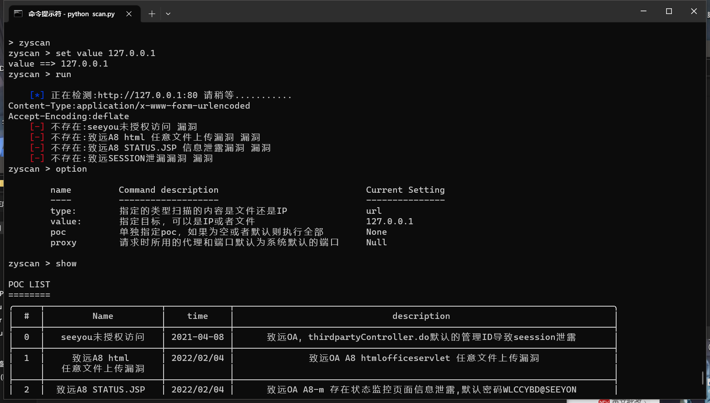
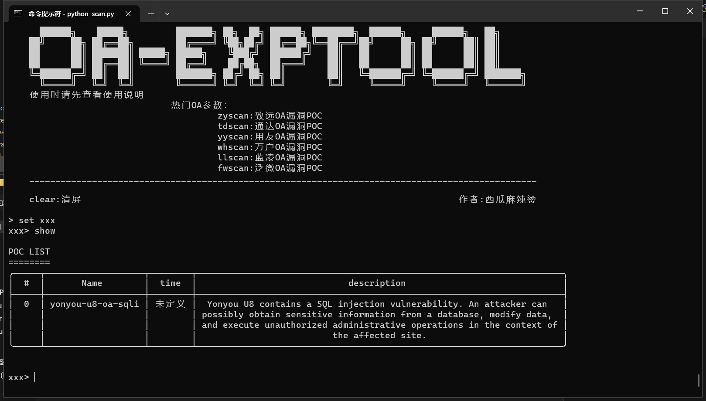

# OA - EXPTOOL 漏洞利用框架

### 公告
    基本上可以说是另一种东西了，重新写了架构
    
    1.操作模式灵感来源MSF，我很喜欢msf，所以用msf的交互模式来写
    
    2.漏洞用YAML文件来验证
    
    3.其实YAML更像nuclei，但我做了统一的规范化，调用方式用了另一种方法

    4.其实还可以写其他的功能模块,后续再更新

    5.这次删掉掉一些POC，选择的poc都是近两年的

### 8月18号更新

- 修复了部分服务器中间件无法识别body的问题
- 更新yongyou部分yaml
- 修复错误yaml
- 泛微42个漏洞已更新完毕，还有一个2021年的部分漏洞没有更新
- 修复一部分小bug
  
### 使用

- 第一次使用脚本请运行pip3 install -r requirements.txt
- 面板是所有参数了致远就输入 zyscan tab键有补全命令的功能
- 进入后help就可以查看，操作和msf一样

### 使用实例

加载已定义的模块

在主界面用set xxx 来加载book中自义定文件夹中的yaml文件

### YAML模板
    id: xxx                                             #漏洞名称:必选项
    time: 'xxx'                                         #纰漏时间:可选项
    
    info:                                                   #这里主要是漏洞的信息：都是可选项
      name: xxxxx                                           #名称
      author: xxxxx                                         #作者
      severity: high                                        #漏洞等级
      description: xxxxxxx                                  #描述信息
      reference: xxxx                                       #参考链接

    http:                                                   编辑请求
      - method: 
          - POST                                            #第一次请求方式 以此类推
          - GET                                             #第二次请求方式
        path:
          - "{{BaseURL}}/xxxxxxxxxxx"                       #第一次请求路径  跟请求方式对应
          - "{{BaseURL}}/xxxxxx"                            #第二次请求路径
        body:
          - |
            "xxxxxxxxx"                                     #有post是必选项 第一次post请求的主体
        Rheader:
          - Content-Type:application/x-www-form-urlencoded & Accept-Enco   #第一次POST请求时的请求头，&分隔开，可选项
        Gheader:
          - Cookie:session & Content-Type:application & Accept-Encoding:deflate  # 第一次GET 请求头，&分隔开，可选项
        
        matchers-condition: and                                        #在最后一次请求后进行验证 所有条件为and或者or
        matchers:                                                           
          - type: word                                                 #key值 必选项
            part: body                                                 #验证的部分 可选项也可以是header和nuclei通用
            words:                                                     #key对应的内容
              - "当前已登录了一个用户，同一窗口中不能登录多个用户"
              - "<a href='/seeyon/main.do?method=logout'"

          - type: status                       #这里对应的是请求的响应                                        
            status:
              - 200     
    
        extractors:                                                    #提取器 
          - name:                          
              - session                                               #Gheader 中的session 上边Gheader中
            part: 
              - Gheader                                               # 提取的部分和赋值给Gheader
            time:                                                     #在第几次请求中进行提取
              - 1
            regex:
              - 'JSESSIONID=(.*)'

如果有任何建议可以找作者联系。欢迎各位提供改进方案
## 作者：西瓜麻辣烫

联系方式/问题群聊：
 
 

